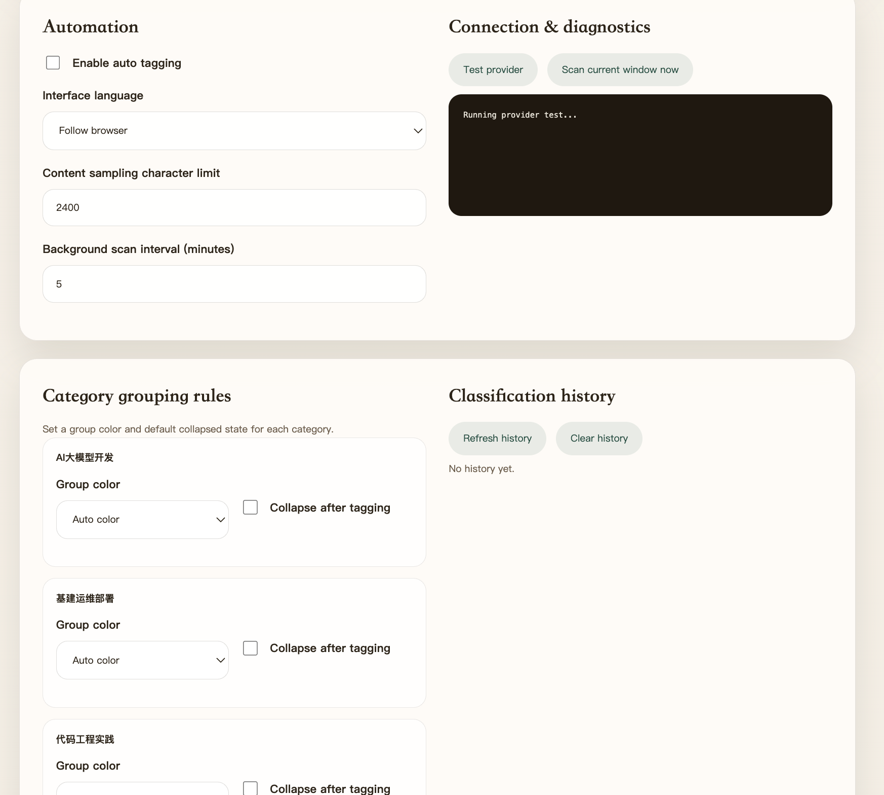
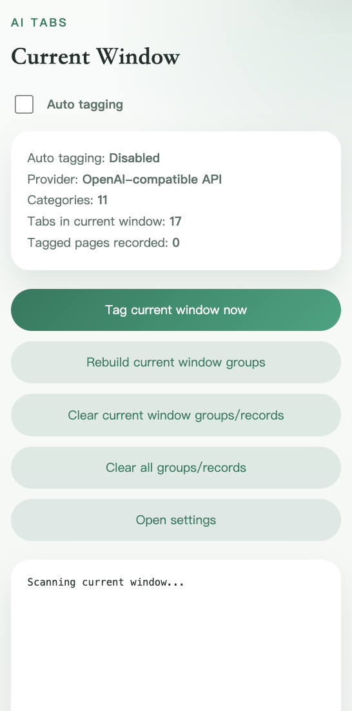
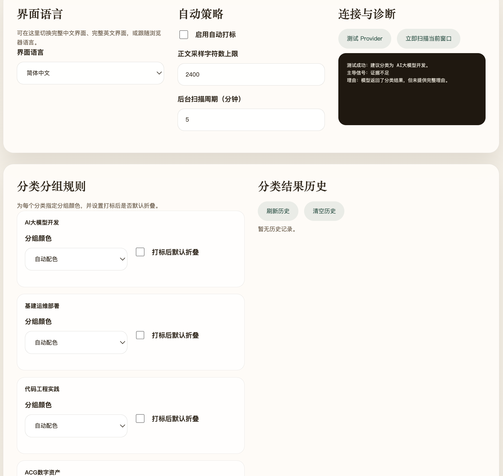

# AI 标签页自动分类

一个中文 Chrome Manifest V3 扩展，用于在标签页失去焦点后，自动把页面分配到你定义的分类中，并通过 `tabGroups` 为标签页打上可视化分组标签。

隐私说明见 [PRIVACY.md](./PRIVACY.md)。

## 界面预览






## 功能概览

- 支持两个 AI Provider
  - `OpenAI 兼容接口`：自定义 `baseUrl`、`apiKey`、`model`
  - `Chrome 内置 AI`：基于 Prompt API / Gemini Nano 的本地语义解析
- 分类目标完全由用户输入，模型只能在给定分类中做选择
- 自动触发条件
  - 标签页未获得焦点
  - 当前页面尚未被打标
  - 页面为 `http/https` 且已完成加载
- 分类优先级固定为
  - `页面标题 > 域名 > 页面正文`
- 支持在设置页中切换 `简体中文 / English / 跟随浏览器`
- 支持中文配置页、弹窗摘要、手动扫描、Provider 测试
- 支持分类结果历史面板，可回看最近自动打标记录
- 支持按分类配置分组颜色和默认折叠策略
- 使用真实 API / 真实浏览器能力，不包含模拟数据

## 项目结构

```text
public/        静态资源与 HTML 入口
src/background 后台服务工作线程与自动分类逻辑
src/offscreen  Chrome 内置 AI 的离屏执行上下文
src/options    中文设置页
src/popup      弹窗摘要
src/shared     类型、配置、提示词工程、存储与工具函数
scripts/       构建辅助脚本
```

## 本地开发

```bash
npm install
npm run typecheck
npm run build
npm run package:store
```

构建产物位于 `dist/`，在 Chrome 扩展管理页中以“加载已解压的扩展程序”方式加载 `dist` 目录即可。
用于 Chrome Web Store 上传的 ZIP 包会生成到 `artifacts/` 目录，并确保 `manifest.json` 位于 ZIP 根目录。

## 使用方式

1. 打开扩展设置页。
2. 输入分类名称，每行一个。
3. 选择 Provider。
4. 如果是 OpenAI 兼容接口，填写 Base URL、API Key、Model。
5. 如果是 Chrome 内置 AI，建议先点击“测试 Provider”完成可用性检查和模型预热。
6. 保存设置。
7. 如有需要，可在“分类分组规则”里为每个分类设置颜色与默认折叠。
8. 可在“分类结果历史”面板中查看最近自动打标记录。
9. 当标签页失焦且页面未打标时，扩展会自动尝试分类并把标签页加入对应分组。

## 关键实现说明

- 自动打标依赖 `chrome.tabs`、`chrome.tabGroups`、`chrome.alarms`、`chrome.scripting`
- Chrome 内置 AI 通过 `offscreen` 文档执行，并使用消息传递与后台协作
- API Key 仅存储在扩展本地 `chrome.storage.local`，并通过 `setAccessLevel(TRUSTED_CONTEXTS)` 限制为受信上下文访问
- 为了支持自定义 API Base URL 和网页正文提取，扩展声明了广泛的 `http/https` host permissions

## 官方参考

- Chrome 扩展文档
  - `tabs` / `storage` / `alarms` / `offscreen` / Prompt API
- Google 官方 samples
  - `functional-samples/ai.gemini-on-device`
  - `functional-samples/ai.gemini-in-the-cloud`
  - `api-samples/alarms`
  - `api-samples/storage/stylizr`
  - `functional-samples/tutorial.reading-time`
- OpenAI 官方 Responses API 与生产最佳实践文档

## 已知限制

- Chrome 内置 AI 的首次模型下载通常需要用户触发，因此建议先在设置页进行 Provider 测试/预热
- 某些网页受 CSP、跨域或浏览器限制影响，正文提取可能失败；此时会退回到标题和域名信号
- 为了减少误判，模型证据不足时会选择不打标，而不是强行归类
- 扩展页、`chrome://` 等非 `http/https` 页面会被主动跳过，不参与分类和 Provider 测试
